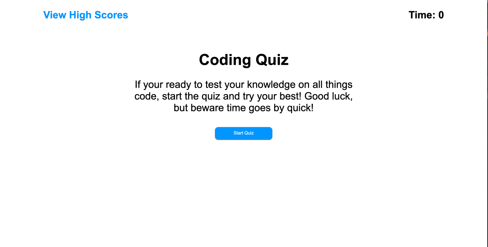
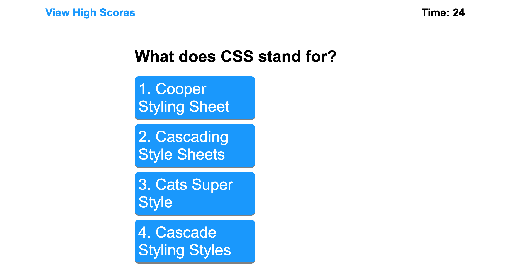
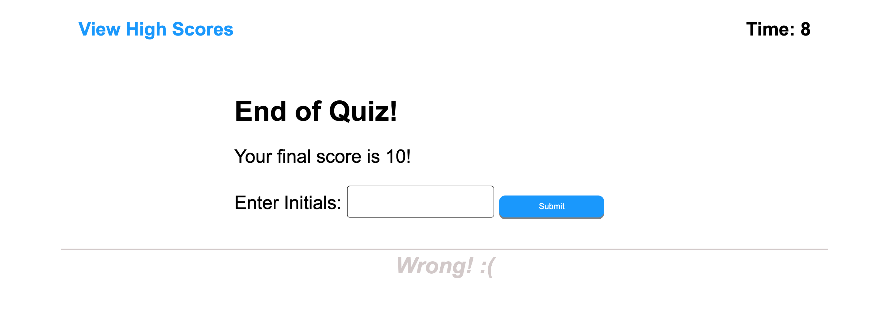

# Timed Coding Quiz

 

  ## Table-of-Contents

  * [Installation](#installation)
  * [Usage](#usage)
  * [Description](#description)
  * [Credits](#credits)
  * [License](#license)
  * [Contributions](#contributions)
  * [Test](#test)
  * [Questions](#questions)

  ## Mock-up

  
  
  
 

  ## Description

  My motivation for this project was to improve on my first take of this project! During my first approach, I wasn't able to give this project a good attempt. Then, I decided to slowly look at the challenge and take a new approach to it. So, I started from scratch again and finally was able to give more effort on this attempt of the coding quiz! 

  I built this project to improve my web development skills all together.

  This app creates a game for users to test their knowledge on  all things web devlelopment while having fun doing so! 

  I learned HTML organization, how important file structure is, website responsive and much more form building this project! 

  ## Installation

  Visit it in the deployed link below! 

  ## Usage

  If your on the homepage, press Start Game and test your knowledge! 

  ## Credits

  

  ## License

  no license

  ## Contributions

  Not accepting contributions at this time, thank you! 

  ## Test

  Visit the deployed link to test application, thank you! 

  ## Questions

  Please contact me using the following links:

  [GitHub](https://github.com/natesoum)

  [Email: nathunsoum@gmail.com](mailto:nathunsoum@gmail.com)